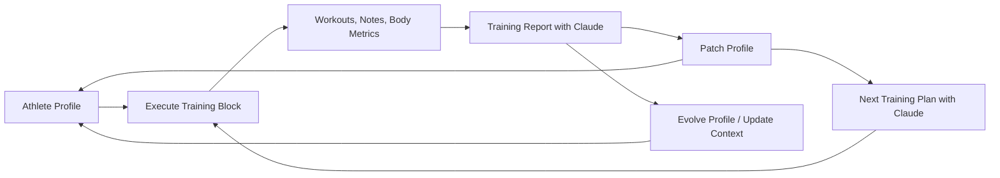

# cycling-coach

Personal cycling training assistant. It ingests workouts from Wahoo, stores subjective notes from Telegram and the admin UI, computes ride metrics from FIT files, imports body metrics from Wyze scale data through a Python sidecar, generates report/plan periods with Claude, and can deliver summaries through Telegram.

This is my first vibe-coded app. The implementation was still reviewed carefully for architecture decisions, code patterns, and runtime behavior, but the project started from that workflow and keeps that spirit.

This file describes the implementation that exists in the repository today. When docs and code differ, the code is the source of truth.

## Core Coaching Loop

The intended use of the app is an AI-assisted coaching cycle built around closed training blocks:

0. Maintain an athlete profile that describes the athlete, constraints, zones, training history, and coaching instructions
1. Execute the current training block and let workouts arrive from Wahoo
3. Add notes and body metrics to explain what happened in real life
4. Close the block and generate the report so Claude can analyze compliance, workout quality, fatigue signals, and trends
5. Generate the next 7-day plan from that fresh report context plus any clarification notes

That execution -> report -> next plan loop is the main feature of the app.

The athlete profile is the base context for this loop. It is stored as markdown, sent to Claude during report and plan generation, and acts as the long-lived coaching memory for the app. It describes things like goals, constraints, zone interpretation, training philosophy, warning flags, and current phase.

The profile can evolve over time through two mechanisms:

- **Weekly profile patch** (automatic): on every block close, after the report is generated and before the plan, a lightweight patch updates three structured sections — the rolling recent-weeks table, milestone statuses, and the last-updated date. This keeps Claude's rolling context fresh without a full rewrite.
- **Evolve Profile** (manual): an admin-triggered full narrative rewrite that uses recent reports to refresh training history, current phase, and long-term context while preserving the protected coaching structure.



## User-Facing Flows

### 1. Connect Wahoo once

- Open `/wahoo/authorize`
- Complete the Wahoo OAuth flow
- The app stores the token and can then ingest workouts through webhook and sync

### 2. Use the admin UI as the main control surface

- Open `/admin`
- Review workouts, processing status, notes, reports, body metrics, and logs
- Trigger sync, FIT processing, report generation, delivery, and profile evolution from the UI
- Inspect per-workout details through the workout action icons

### 3. Keep daily context up to date

- Add ride notes and general notes from Telegram or from the admin UI
- Track weight, body fat, and muscle metrics over time
- Keep the athlete profile current so Claude has the right long-term context
- If no workout exists by 23:50 local time, the app creates a placeholder day entry so the timeline stays complete

### 4. Close blocks and generate outputs

- Close the completed block from the admin UI
- The app generates the finished-block report, patches the profile with the week's rolling data, and then generates the next 7-day plan — all in one step
- The profile patch updates the recent-weeks table, milestone statuses, and last-updated date so the plan benefits from the freshest context
- Use the optional clarification prompt to explain travel, fatigue, schedule drift, or constraints for the next block
- Review rendered HTML in the browser
- Optionally send the summary and link to Telegram

## Current Runtime Flow

1. Wahoo OAuth is completed through `/wahoo/authorize` and `/wahoo/callback`.
2. Workouts arrive through the Wahoo webhook and optional manual/scheduled sync.
3. Workout rows are stored in SQLite and FIT files are downloaded to disk when available.
4. FIT processing computes per-ride metrics such as NP, IF, TSS, TRIMP, HR drift, decoupling, power/HR zone distribution, cadence distribution, and power/HR zone timelines.
5. Training reports and plans are assembled from workouts, computed metrics, notes, body metrics, and the athlete profile markdown.
6. Claude returns structured JSON with a Telegram-sized summary plus a full narrative.
7. The app renders HTML, stores it in the database, serves it at `/reports/{id}` or `/plans/{id}`, and can send the summary + link to Telegram.

## Implemented Areas

### Wahoo

- OAuth2 token storage and refresh
- `POST /wahoo/webhook`
- Paginated workout sync through the Wahoo API
- FIT download when the API payload contains a file URL
- Idempotent workout ingestion keyed by `wahoo_id`
- Webhook ingestion explicitly maps Wahoo's documented nested webhook payload, where workout identity/start time are under `workout_summary.workout` and the FIT URL is under `workout_summary.file`

### Analysis

- FIT parsing with `github.com/muktihari/fit`
- Per-ride metrics stored in `ride_metrics`
- Reprocessing, FIT reset, and FIT ignore flows through the admin/API layer
- FIT time-series CSV export from stored FIT files
- Per-ride detail for Claude now includes:
  - summary-row metrics including average cadence
  - power zone percentages
  - HR zone percentages
  - cadence distribution bands: `<70`, `70-85`, `85-100`, `100+`
  - power zone timeline
  - HR zone timeline

### Reporting

- Closed-block report generation
- Automatic profile patch after report generation: appends a row to the recent-weeks table, updates milestone statuses, and sets the last-updated date
- Next-plan generation from the freshly closed block, using the just-patched profile for the freshest context
- Profile patch failure is non-fatal — the plan is generated regardless
- Standalone report/plan generation capability still exists in the backend, but the admin UI now centers the combined close-block workflow
- Claude analysis of completed periods using workouts, metrics, notes, and athlete profile context
- HTML rendering stored in `reports.full_html`
- Saved system/user prompts for generated reports, plans, and progress interpretations
- Telegram delivery with persisted delivery state and retry support
- Athlete profile evolution from recent reports

### Progress

- Progress page in the admin UI with date-filtered KPI cards and trend arrows
- KPIs include aerobic efficiency, decoupling, TSS, TRIMP, average IF, completion rate, calories, and conditional weight comparison
- Selected-period vs prior-period comparison
- Single saved AI interpretation for a chosen `from -> today` window
- Saved system/user prompts for that interpretation, viewable from the UI

### Athlete Profile

- Markdown-based long-lived coaching context
- Used as base prompt context for both plans and reports
- Stored outside the database as a runtime file at `ATHLETE_PROFILE_PATH`
- Bootstrapped from `config/athlete-profile.default.md` on first startup
- Can be updated manually or evolved from recent reports through the admin UI
- Contains 8 protected sections required by the profile-evolution and profile-patch validators
- Automatically patched on every block close (recent-weeks table, milestone statuses, last-updated date)
- Profile is backed up before every patch or evolution write

### Telegram

- Inbound commands: `/help`, `/start`, `/ride`, `/note`, `/weight`, `/bodyfat`, `/muscle`, `/profile`, `/profile set`
- Outbound report delivery through the Bot API
- Linking ride/note entries to the most recent workout within the last 12 hours

### Wyze

- Python sidecar integration for Wyze scale records
- Manual or scheduled historical sync into `athlete_notes`
- Idempotent import tracking through `wyze_scale_imports`
- Additional imported body metrics:
  - hydration / body water
  - BMR
- Structured body-metric block included in the Claude report/plan prompt
- Admin `Wyze Sync` tab with:
  - manual sync form
  - mixed manual + Wyze body-metric table
  - duplicate-aware delete actions

### Admin / HTTP

- Admin UI at `/admin`
- Health endpoint at `/health`
- APIs for sync, processing, close-block generation, report generation, report sending, report deletion, note management, progress, body metrics, Wyze sync/records/conflicts, log streaming, and profile evolution
- SSE log stream at `/api/logs/stream`
- Workout admin actions for note state, summary-row preview, per-ride zone preview, and FIT time-series download
- Body-metrics charts with date-range filtering
- Body-metrics charts suppress manual rows that duplicate same-day Wyze records
- Reports & Plans table grouped by period: each row pairs the plan and the report for the same `[week_start, week_end]` window side-by-side, so a plan and the later report analyzing that same period appear together (with `—` shown when one side hasn't been generated yet)

## Current Routes

### Public / integration routes

- `GET /health`
- `GET /wahoo/authorize`
- `GET /wahoo/callback`
- `POST /wahoo/webhook`

### Report pages

- `GET /reports/{id}`
- `GET /plans/{id}`

### Admin/API routes

- `GET /admin`
- `POST /api/sync`
- `POST /api/wyze/sync`
- `POST /api/process`
- `POST /api/workout/reset-fit`
- `POST /api/workout/ignore`
- `POST /api/report`
- `POST /api/report/close-block`
- `POST /api/report/send`
- `DELETE /api/report/{id}`
- `GET /api/report/{id}/prompts`
- `POST /api/profile/evolve`
- `GET /api/progress`
- `POST /api/progress/interpret`
- `GET /api/body-metrics`
- `GET /api/wyze/conflicts`
- `GET /api/wyze/records`
- `DELETE /api/wyze/conflicts/{id}`
- `DELETE /api/wyze/records/{id}`
- `POST /api/notes`
- `GET /api/notes`
- `PUT /api/notes/{id}`
- `DELETE /api/notes/{id}`
- `GET /api/workouts/{id}/data`
- `GET /api/workouts/{id}/timeseries.csv`
- `GET /api/logs/stream`

## Current Telegram Commands

- `/help`
- `/start`
- `/ride <text>`
- `/note <text>`
- `/weight <kg>`
- `/bodyfat <pct>`
- `/muscle <kg>`
- `/profile`
- `/profile set` with an attached `.md` file

Commands such as `/status`, `/week`, and `/plan` are mentioned in older design docs but are not implemented in the current codebase.

## Configuration

Copy `.env.example` to `.env` and fill in the required values.

```bash
cp .env.example .env
```

### Required for Wahoo integration

```env
WAHOO_CLIENT_ID=
WAHOO_CLIENT_SECRET=
WAHOO_REDIRECT_URI=http://localhost:8080/wahoo/callback
```

For production, set `WAHOO_REDIRECT_URI` to your public callback URL.

### Optional integrations

Telegram is optional. If `TELEGRAM_BOT_TOKEN` or `TELEGRAM_CHAT_ID` is missing, inbound bot handling and report delivery are disabled.

Claude-backed report generation requires `ANTHROPIC_API_KEY`.

Wyze is optional. To enable it, configure the Go app to talk to the sidecar and configure the Python sidecar with Wyze credentials:

```env
WYZE_SIDECAR_URL=http://localhost:8090
WYZE_EMAIL=
WYZE_PASSWORD=
WYZE_KEY_ID=
WYZE_API_KEY=
WYZE_TOTP_KEY=
```

### Scheduler

The scheduler exists in code, but jobs are registered only when cron environment variables are set:

```env
CRON_SYNC=
CRON_FIT_PROCESSING=
CRON_WEEKLY_REPORT=
CRON_WYZE_SCALE_SYNC=
```

If all three are empty, the scheduler starts with no active jobs.

One scheduler job is always registered in code and is not env-controlled:

- `23:50 Europe/Amsterdam`: create a manual placeholder workout for that day when no workout exists yet

If a real Wahoo workout for that same day arrives later, the placeholder workout is automatically reconciled away and any notes linked to it are moved onto the real workout.

## Main Interaction: Admin UI

After configuration, the admin UI is the primary way to use the app.

Open:

```text
http://localhost:8080/admin
```

From there you can:

- review workouts and their processing state
- trigger Wyze body-metric sync
- open ride notes and general notes
- inspect the summary row sent to Claude
- inspect the per-ride zone detail sent to Claude
- download FIT time-series CSV data
- trigger sync and FIT processing
- close the current block and generate the finished-block report plus the next 7-day plan
- send reports through Telegram
- inspect logs live through SSE-backed log streaming
- review body metrics with date filtering
- review mixed manual + Wyze body-metric rows and delete duplicate records from the Wyze tab
- review progress KPIs and save an AI-generated trend interpretation
- review and evolve the athlete profile

The backend HTTP endpoints still exist and are useful for automation or debugging, but they are secondary to the admin UI for day-to-day use.

## Quick Start

```bash
docker compose up -d
```

On first startup:

- the SQLite database is created and migrated
- the FIT files directory is created
- `config/athlete-profile.default.md` is copied to `ATHLETE_PROFILE_PATH` if no runtime athlete profile exists
- default athlete config values are seeded into `athlete_config` if keys are missing

Then:

```text
1. Open http://localhost:8080/wahoo/authorize
2. Complete Wahoo authorization
3. Open http://localhost:8080/admin
```

## Admin UI Walkthrough

### Workouts

- See each day’s workout row, keyed visually by external `wahoo_id`
- Use a single data/action column for ride notes, general notes, summary preview, zone preview, and FIT CSV download
- Grey icons indicate that a note or workout-derived artifact is not available for that day
- Placeholder rows fill in days with no recorded workout yet

### Notes

- Add, edit, and delete notes directly from the admin UI
- Use notes to explain skipped sessions, changed workouts, fatigue, travel, or other context
- Ride-linked and general notes are both visible from the workout/day context

### Body Metrics

- Review weight, body fat, muscle mass, hydration, and BMR over time
- Filter charts by `From` / `To` date range

### Wyze Sync

- Sync body metrics from Wyze for a chosen period
- Review the mixed manual + Wyze body-metric table
- Delete duplicate manual or Wyze rows directly from the UI when they are flagged as duplicates

### Reports and Plans

- Generate plans from the current athlete profile and recent context
- Plan generation also reads up to the 3 most recent weekly reports as continuity context, so the next plan extends recent recommendations rather than restarting progression
- Generate reports that compare completed training against intent and actual outcomes
- Open rendered HTML pages in the browser
- Send generated outputs to Telegram when delivery is configured

### Athlete Profile

- Treat the athlete profile as the coaching baseline for the AI
- Edit it when goals, constraints, or coaching guidance change
- Use "Evolve Profile" when you want the app to refresh the long-term narrative from recent reports

### Logs

- Watch application logs live from the admin UI
- Use this to confirm webhook arrival, sync behavior, processing, and report generation

## API / Curl Examples

The HTTP API remains available for automation, testing, and debugging.

### Sync workouts

```bash
curl -X POST http://localhost:8080/api/sync
```

Optional date range:

```bash
curl -X POST http://localhost:8080/api/sync \
  -H 'Content-Type: application/json' \
  -d '{"from":"2026-03-01","to":"2026-03-31"}'
```

Webhook note:

- the polling API and webhook payloads are not treated as identical
- polling uses top-level workout fields plus nested `workout_summary`
- the webhook uses nested workout fields under `workout_summary.workout`
- the webhook FIT URL is read from `workout_summary.file.url`
- the current implementation converts the webhook payload into the shared ingestion shape before inserting/downloading

### Process FIT files

```bash
curl -X POST http://localhost:8080/api/process
```

Reprocess everything:

```bash
curl -X POST http://localhost:8080/api/process \
  -H 'Content-Type: application/json' \
  -d '{"reprocess_all":true}'
```

### Generate a report or plan directly

```bash
curl -X POST http://localhost:8080/api/report \
  -H 'Content-Type: application/json' \
  -d '{"type":"weekly_report","week_start":"2026-03-23","week_end":"2026-04-04"}'
```

```bash
curl -X POST http://localhost:8080/api/report \
  -H 'Content-Type: application/json' \
  -d '{"type":"weekly_plan","week_start":"2026-04-05","week_end":"2026-04-11","user_prompt":"Travelling Tuesday, keep Wednesday short"}'
```

### Send a generated report

```bash
curl -X POST http://localhost:8080/api/report/send \
  -H 'Content-Type: application/json' \
  -d '{"report_id":1}'
```

### Create a note from the admin/API side

```bash
curl -X POST http://localhost:8080/api/notes \
  -H 'Content-Type: application/json' \
  -d '{"type":"note","note":"Travel day, skipped training","workout_id":1421}'
```

### Filter body metrics by date

```bash
curl "http://localhost:8080/api/body-metrics?from=2026-03-01&to=2026-03-31"
```

### Sync Wyze body metrics

```bash
curl -X POST http://localhost:8080/api/wyze/sync \
  -H 'Content-Type: application/json' \
  -d '{"from":"2026-04-01","to":"2026-04-09"}'
```

### List Wyze tab records

```bash
curl "http://localhost:8080/api/wyze/records?from=2026-04-01&to=2026-04-09"
```

### List explicit Wyze conflicts

```bash
curl http://localhost:8080/api/wyze/conflicts
```

### Delete a duplicate manual row from the Wyze table

```bash
curl -X DELETE "http://localhost:8080/api/wyze/records/14?source=manual"
```

### Delete a duplicate Wyze row from the Wyze table

```bash
curl -X DELETE "http://localhost:8080/api/wyze/records/18?source=wyze"
```

### Delete the manual or Wyze side of an explicit tracked conflict

```bash
curl -X DELETE "http://localhost:8080/api/wyze/conflicts/1?side=manual"
curl -X DELETE "http://localhost:8080/api/wyze/conflicts/1?side=wyze"
```

### Download workout FIT time-series data

```bash
curl -O http://localhost:8080/api/workouts/1421/timeseries.csv
```

## Data Model

Main tables:

- `wahoo_tokens`
- `workouts`
- `ride_metrics`
- `athlete_notes`
- `athlete_config`
- `reports`
- `report_deliveries`
- `workout_types`

The `workouts` table now also stores synthetic manual placeholder rows for days where no workout was recorded by 23:50 local time. These placeholders are created with source `manual`, are marked processed immediately, and can later be replaced automatically by a real Wahoo workout from the same day.

Migrations are defined in [`internal/storage/db.go`](/Users/ananchev/Development/cycling-coach/internal/storage/db.go).

## Rendering Note

Report HTML is currently rendered by inline Go code in [`internal/reporting/renderer.go`](/Users/ananchev/Development/cycling-coach/internal/reporting/renderer.go) and stored in the database.

## Development

```bash
make dev
make test
make lint
make build
make run
```

## Related Docs

- [`CLAUDE.md`](/Users/ananchev/Development/cycling-coach/CLAUDE.md) for repo-specific development guidance
- [`ARCHITECTURE.md`](/Users/ananchev/Development/cycling-coach/ARCHITECTURE.md) for an implementation-aligned architecture summary
